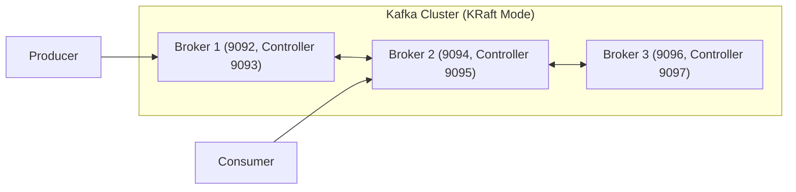

# interview-notes.md — Apache Kafka Interview Preparation Notes

This document provides **concise, recall-friendly summaries** of key Kafka concepts.  
Each section contains **short bullet points (5–10 max)** designed for **quick interview revision**.  
Keep this file brief and to the point — not a detailed explanation.

---

## 🧩 Core Concepts

- Kafka is a **distributed, partitioned, replicated commit log** system.
- A **topic** is a category/feed name to which records are published.
- **Partitions** allow parallelism and scalability.
- **Producers** write data to topics; **consumers** read from them.
- Kafka provides **high throughput**, **durability**, and **fault-tolerance**.

---

## 📘 Kafka vs RabbitMQ / System Design and I/O Internals

**Architecture Type**
- Kafka = Distributed Commit Log; RabbitMQ = Message Broker Queue.

**Message Flow Model**
- Kafka = **Pull-based** — consumers poll brokers at their own pace.  
- RabbitMQ = **Push-based** — broker delivers messages automatically via AMQP.

**Protocols**
- Kafka → Binary TCP protocol on port 9092.  
- RabbitMQ → AMQP (Advanced Message Queuing Protocol) on port 5672.

**Acknowledgment**
- Kafka → Consumers commit offsets to track progress.  
- RabbitMQ → Consumers send ACK/NACK responses.

**Storage & Durability**
- Kafka → Persisted on disk (append-only log); messages retained after consumption → supports replay, auditing, and recovery.  
- RabbitMQ → Typically transient (queue empties after ACK).

**Performance Internals**
- Kafka uses **sequential writes** (no random I/O) → high throughput.  
- Utilizes **zero-copy transfer (sendfile)** → kernel to network without user-space copy.  
- Uses **page cache batching** and **compression** for performance.  

**Cluster Coordination**
- Managed by **Zookeeper** (legacy) or **KRaft** (modern controller quorum).  

**Hardware Profile**
- Runs on **commodity servers** (standard hardware) yet scales to millions of messages per second.  

**Key Terms**
- **Broker** = Kafka server storing topic partitions.  
- **Partition** = Append-only log file.  
- **Offset** = Consumer’s bookmark.  
- **Retention Policy** = Controls data lifecycle, not consumption.

---

## 🧱 Kafka Internals

- Messages stored in **segment files** (append-only logs).
- **Index files** provide O(1) access by offset.
- **Retention** policy: time-based or size-based cleanup.
- **Compaction** keeps latest key-value per key.
- **ISR (In-Sync Replicas)** ensure data reliability.

---

## 🏗️ Kafka Architecture & Coordination (Zookeeper vs KRaft)

**Cluster Structure**
- Kafka cluster = multiple brokers (servers) storing topic partitions.  
- Each partition → one leader + N followers (replicas).  
- **Controller** = broker responsible for leader elections and metadata sync.

**Zookeeper Mode (Legacy)**
- External coordination service on **port 2181**.  
- Brokers register with Zookeeper; ZK stores metadata & partition leadership.  
- Clients (producers/consumers) connect only to brokers (9092); brokers query Zookeeper for metadata.  
- Requires two services → Zookeeper + Kafka broker.

**KRaft Mode (Modern)**
- Zookeeper removed — Kafka includes its own controller process.  
- Each broker has a **controller listener (9093+)** for internal metadata sync.  
- Controllers form a **Raft quorum** (majority ack = metadata commit).  
- Brokers replicate metadata from controllers internally.  
- Clients still connect only to **brokers (9092)**.  
- Simplified deployment → no external Zookeeper.

**Ports Summary**
| Mode | Component | Port | Purpose |
|------|------------|------|----------|
| Zookeeper Mode | Zookeeper | 2181 | Cluster coordination & leader election |
| Zookeeper Mode | Broker | 9092 | Producer/Consumer connections |
| KRaft Mode | Broker | 9092 | Producer/Consumer connections |
| KRaft Mode | Controller | 9093 | Raft metadata communication |

**Raft Consensus Quick Facts**
- Metadata changes → written to Raft log then replicated.  
- Quorum ack required (3 controllers → 2 acks minimum).  
- Ensures strong consistency and fault tolerance.  
- Replaces Zookeeper leader election mechanism.

**Parallelism & Scalability**
- **Partitions** enable parallel reads/writes.  
- Producers write to multiple partitions → parallel I/O.  
- Consumers in a group each read different partitions → parallel processing.  
- Linear scaling by increasing partitions and brokers.

**Visualization Hint (for GitHub .md)**

---

## 🔐 Security

- Supports **SSL/TLS encryption**, **SASL** authentication.
- ACLs define access at topic/group/cluster level.
- Common mechanisms: `SASL_PLAINTEXT`, `SASL_SSL`, `SCRAM-SHA-256`.

---

## 🧩 Kafka Connect

- Framework for **data integration** — Source & Sink connectors.
- Simplifies connecting Kafka with databases and external systems.
- Configurable via REST API.
- Common connectors: JDBC, FileStream, Debezium, Elasticsearch.

---

## 🧮 Kafka Streams

- Client library for building stream-processing apps.
- Core abstractions: **KStream**, **KTable**, **GlobalKTable**.
- Stateful transformations use **state stores**.
- Provides exactly-once semantics and fault tolerance.

---

## 🏗️ Cluster Management

- **Broker**: runs Kafka server instance.
- **Controller**: manages leader election and metadata.
- **Zookeeper/KRaft**: metadata management (KRaft replacing Zookeeper).
- **Replication factor** controls fault tolerance.
- **KRaft** = built-in controller quorum replacing Zookeeper.  
- **Controller port 9093+** handles Raft metadata replication.  
- **Clients** use only broker ports (9092).  

---

## ⚡ Performance Tuning

- Use compression: `lz4`, `snappy` for throughput.
- Tune producer batch & linger settings.
- Optimize consumer fetch sizes.
- Use multiple partitions for parallelism.
- Monitor via JMX, Prometheus, Grafana.

---

## 🧰 Operational Topics

- **Monitoring**: lag, throughput, ISR count, disk usage.
- **Scaling**: add brokers, rebalance partitions.
- **Disaster Recovery**: MirrorMaker / MirrorMaker2 for replication.
- **Retention Policies** must match business SLAs.

---

## 🎯 Interview Quick Tips

- Kafka is **pull-based**, RabbitMQ is **push-based**.  
- Kafka retains data post-consumption → supports **replay, auditing, and recovery**.  
- Sequential disk writes + zero-copy I/O = **high throughput**.  
- Kafka = binary TCP protocol; RabbitMQ = AMQP.  
- Commodity hardware can support massive throughput.  
- Coordination via Zookeeper/KRaft ensures partition leadership and fault tolerance.  
- Ideal for event-driven microservices and streaming pipelines.  
- Understand message delivery semantics: *at-most-once, at-least-once, exactly-once.*  
- Be able to explain **rebalance process** clearly.  
- Know **how offsets are managed** internally.  
- Understand **log compaction vs retention**.  
- Be comfortable with **producer/consumer configurations** for reliability.

---

**Maintained by:** [@goisemail](https://github.com/goisemail)  
**Last updated:** 2025-10-26  
**Purpose:** Quick interview reference for Apache Kafka (not a full tutorial).
