# Lesson 02 — Kafka Architecture Overview (Fast-Track with Deep Insights)

## 🎯 Objectives
- Understand how Kafka’s architecture evolved from **Zookeeper** to **KRaft (Kafka Raft Mode)**.  
- Learn how **producers, brokers, consumers, controllers** communicate.  
- Understand **how metadata is handled** internally now.  
- Learn **how to run Kafka (Zookeeper vs KRaft)** practically using Docker.  
- Master **Raft quorum**, **leader election**, and **metadata replication**.  
- Visualize the entire cluster flow using **Mermaid.js diagrams**.

---

## 🧱 1️⃣ Kafka Core Components Overview

| Component | Role | Description |
|------------|------|-------------|
| **Producer** | Publishes data to topics. |
| **Consumer** | Reads data from topics. |
| **Broker** | Kafka server that stores and serves topic partitions. |
| **Partition** | Append-only log file that provides scalability and ordering. |
| **Controller** | Manages metadata, leader election, and broker coordination. |
| **Zookeeper / KRaft** | Coordination and metadata storage system. (external → internal evolution) |

---

## ⚙️ 2️⃣ Kafka Components — Old vs New Execution Models

### 🐳 **Zookeeper Mode (Legacy Architecture)**

Kafka depends on an **external Zookeeper service** for cluster coordination and metadata.

| Service | Port | Purpose |
|----------|------|---------|
| **Zookeeper** | 2181 | Manages metadata, partition leadership, and broker registration. |
| **Kafka Broker** | 9092 | Stores partitions, handles producer/consumer requests. |

Example Docker setup:
```bash
# Run Zookeeper
docker run -d --name zookeeper --network kafka-net   -p 2181:2181 bitnami/zookeeper:latest

# Run Kafka (linked to Zookeeper)
docker run -d --name kafka --network kafka-net   -p 9092:9092   -e KAFKA_ZOOKEEPER_CONNECT=zookeeper:2181   -e ALLOW_PLAINTEXT_LISTENER=yes   bitnami/kafka:latest
```
Here:
- Zookeeper = **Central Coordinator**
- Kafka Broker = **Worker node** that stores messages.

---

### ⚡ **KRaft Mode (Modern Architecture)**

Zookeeper is now **removed**.  
Kafka’s coordination layer is built-in — powered by **Raft consensus**.

Each Kafka node runs two logical components:
| Component | Typical Port | Description |
|------------|---------------|-------------|
| **Broker** | 9092 | Handles producers & consumers. |
| **Controller (KRaft)** | 9093 | Coordinates metadata, leader elections, Raft replication. |

Example Docker setup:
```bash
docker run -d --name kafka-kraft --network kafka-net   -p 9092:9092 -p 9093:9093   -e KAFKA_CFG_PROCESS_ROLES=broker,controller   -e KAFKA_CFG_NODE_ID=1   -e KAFKA_CFG_CONTROLLER_QUORUM_VOTERS=1@localhost:9093   -e KAFKA_CFG_LISTENERS=PLAINTEXT://:9092,CONTROLLER://:9093   -e KAFKA_CFG_CONTROLLER_LISTENER_NAMES=CONTROLLER   -e ALLOW_PLAINTEXT_LISTENER=yes   bitnami/kafka:latest
```
In this configuration:
- Kafka acts as **both broker + controller** (single-node KRaft cluster).  
- Multi-broker clusters use unique ports (9092/9093, 9094/9095, etc.) per node.

---

## 🧭 3️⃣ Coordination Responsibilities — Deep Understanding

| Function | Zookeeper Mode | KRaft Mode |
|-----------|----------------|-------------|
| Broker registration | Broker → Zookeeper | Broker → Internal Controller |
| Metadata storage | Zookeeper znodes | KRaft metadata Raft log |
| Leader election | Zookeeper triggers controller | Raft consensus between controllers |
| Cluster membership | Maintained by Zookeeper | Managed internally in controller quorum |
| Failure recovery | Zookeeper reassigns leaders | Raft promotes new leader automatically |
| Complexity | Needs two services | Self-contained single binary |
| Introduced in | Legacy 0.8–2.7 | Kafka 2.8+ (default 3.5+) |

💡 **KRaft = Kafka + Raft = Self-managed metadata and consensus.**

---

## 🔁 4️⃣ Metadata Flow — Producer and Consumer Interaction

### 🧩 OLD FLOW — Zookeeper Mode

#### 🧠 How It Works
1. **Producer** connects to any broker (bootstrap).  
2. Broker queries **Zookeeper (2181)** for metadata (leader info, partitions).  
3. Zookeeper returns metadata.  
4. Broker shares metadata with producer.  
5. Producer sends data to leader broker → broker writes to log file.  
6. Consumer fetches data from leader broker (9092).

#### 📡 Internal Port Summary — Zookeeper Mode

| Port | Component | Accessed By | Purpose |
|------|------------|-------------|----------|
| **2181** | Zookeeper | Brokers | Cluster metadata and leader election |
| **9092** | Kafka Broker | Producers / Consumers | Data read/write |

---

### 🧩 NEW FLOW — KRaft Mode

#### 🧠 How It Works
1. **Producer/Consumer** connects to any broker (9092).  
2. Broker already has metadata replicated from its internal **controller (9093)**.  
3. Broker responds directly to client with metadata — no external lookup.  
4. Producer writes to leader partition → broker appends → followers replicate asynchronously.  
5. Broker sends ack to producer (`acks=0|1|all`).  
6. Consumer polls and commits offsets to Kafka (`__consumer_offsets` topic).  

#### 📡 Internal Port Summary — KRaft Mode

| Port | Component | Accessed By | Purpose |
|------|------------|-------------|----------|
| **9092** | Broker | Producers / Consumers | Client connections (data pipeline) |
| **9093** | Controller (KRaft) | Other brokers | Internal metadata sync (Raft quorum) |

💡 **Clients still never contact controllers.**  
They only connect to brokers, which sync metadata internally via Raft.

---

## ⚖️ 5️⃣ Raft Consensus and Quorum in KRaft

- **Metadata Log:** all metadata changes (topics, brokers, configs) are written to a replicated Raft log.  
- **Quorum:** majority of controllers must acknowledge before commit.  
  - 3 controllers → quorum = 2  
  - 5 controllers → quorum = 3  
- **Failover:** if one controller fails, another takes over seamlessly.  
- **Consistency:** every broker has consistent metadata synced from controller quorum.

💡 KRaft provides **fault-tolerant metadata management** without Zookeeper.

---

## 🧩 6️⃣ Practical Access to KRaft Mode (Non-Docker CLI)

```bash
# 1️⃣ Generate Cluster ID
./bin/kafka-storage.sh random-uuid

# 2️⃣ Format Storage
./bin/kafka-storage.sh format -t <uuid> -c config/kraft/server.properties

# 3️⃣ Start Kafka (KRaft)
./bin/kafka-server-start.sh config/kraft/server.properties
```
Example `server.properties` file:
```properties
process.roles=broker,controller
node.id=1
controller.quorum.voters=1@localhost:9093
listeners=PLAINTEXT://localhost:9092,CONTROLLER://localhost:9093
controller.listener.names=CONTROLLER
log.dirs=/tmp/kraft-combined-logs
```

---

## 💡 7️⃣ Producer/Consumer – Controller Interaction (Detailed Explanation)

- **In Zookeeper Mode:**
  - Brokers contact **Zookeeper (2181)** for metadata.  
  - Producers/Consumers connect only to **Brokers (9092)**.  
  - Zookeeper acts as a centralized coordinator.

- **In KRaft Mode:**
  - Each broker has its own **Controller (9093, 9095, etc.)**.  
  - Brokers talk internally to controllers to fetch metadata (via Raft).  
  - Producers/Consumers continue to talk only to **Brokers (9092)**.  
  - Controllers coordinate among themselves (quorum) to maintain consistency.

📘 So — Clients → Brokers → Controllers (internally)  
Never Clients → Controllers.

---

## 🧮 8️⃣ How Partitions Provide Parallelism and Scalability

### Producer-Side
- Each partition is a separate log file (independent write path).  
- Producers distribute messages based on key hash or round-robin.  
- Brokers handle separate partitions — spreading write load.

### Consumer-Side
- Consumers in a group divide partitions among themselves.  
- Each consumer processes its own subset → parallel reading.

💡 Kafka scales linearly with partitions.

---

## 🧰 9️⃣ Visualization — Complete Kafka Architecture

### A. Zookeeper Mode (Legacy)


---

### B. KRaft Mode (Modern)


---

### C. Raft Consensus Visualization

```mermaid
flowchart LR
    subgraph CONTROLLERS["KRaft Controller Quorum"]
        C1[Controller 1]
        C2[Controller 2]
        C3[Controller 3]
    end
    C1 -->|Write Metadata| C2
    C2 -->|Ack| C1
    C3 -->|Ack| C1
    B[Broker] -->|Fetch Metadata| C1
```


---

## 🧠 10️⃣ Key Takeaways

- Zookeeper coordinated brokers externally; KRaft does it internally.  
- Clients never contact Zookeeper or controllers directly.  
- Brokers talk to controllers internally for metadata sync.  
- KRaft uses Raft quorum → majority vote for consistency.  
- Each broker (in KRaft mode) has both **data port (9092)** and **controller port (9093)**.  
- Zookeeper mode requires **two services**, KRaft mode is **self-contained**.  
- KRaft simplifies deployment and provides faster metadata updates.  

---

**End of Lesson 02 — Kafka Architecture Overview (Final Deep-Dive Edition)**  
**Next:** Lesson 03 — Kafka Setup and Topic Creation (Fast-Track)
